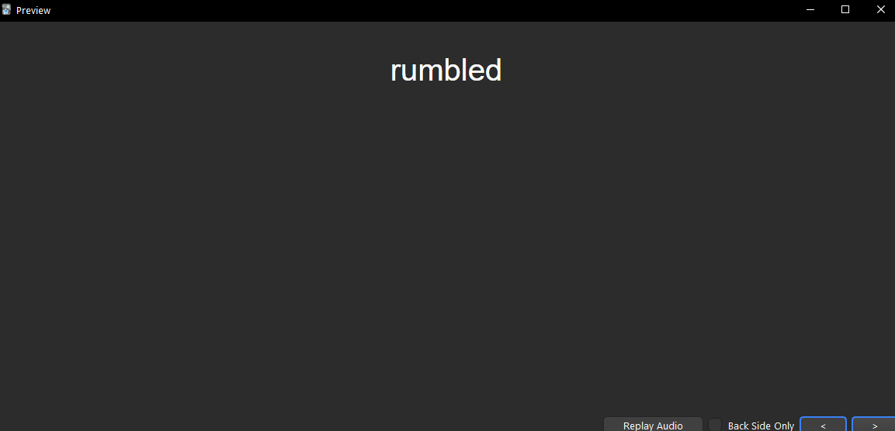
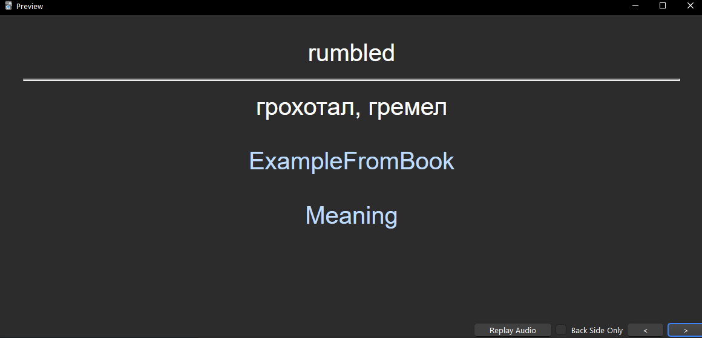
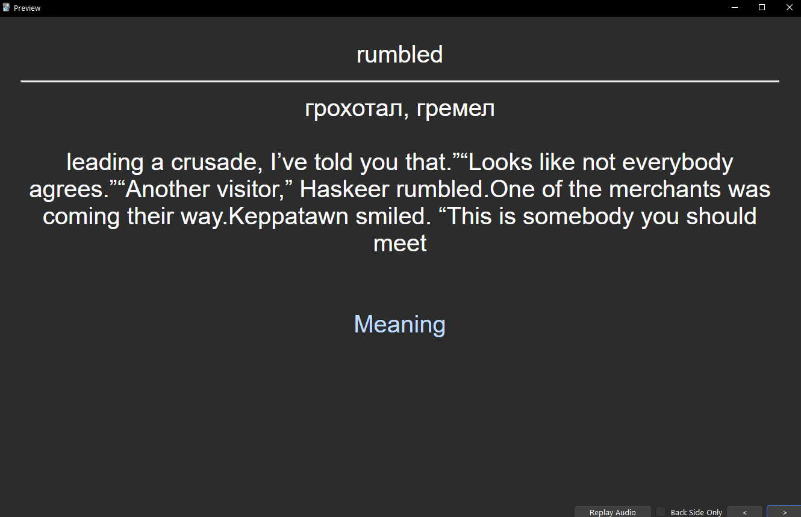
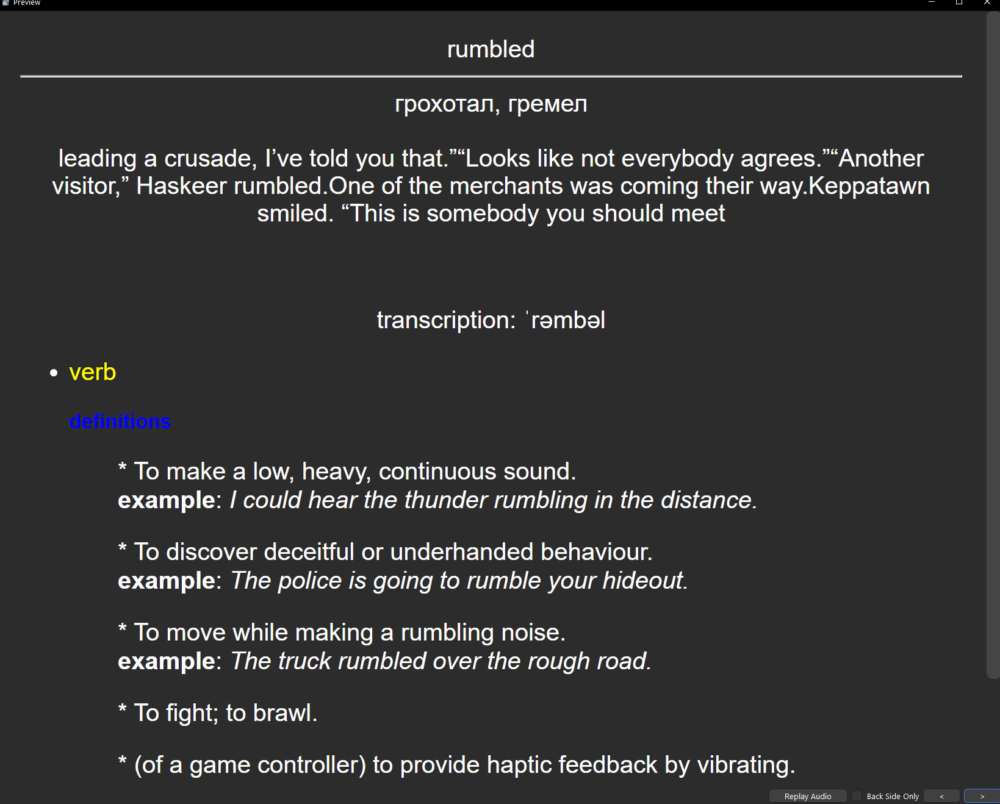

## korvo-to-anki

[](https://github.com/Dankoy/korvo-to-anki/releases/latest)


[](https://github.com/Dankoy/korvo-to-anki/actions/workflows/gradle.yml)

[](https://hits.seeyoufarm.com)


Convert sqlite created
by [vocabulary_builder plugin](https://github.com/koreader/koreader/wiki/Vocabulary-builder)
of [KOReader](https://github.com/koreader/koreader) into text file that can be easily
imported to anki

If you want to lemmatize all your words then check another utility - [korvo-to-anki-lemmatizer](https://github.com/Dankoy/korvo-to-anki-lemmatizer)

### Stack

* Java 21
* Spring boot 3.3.2
* Spring shell
* Spring boot jdbc
* Caffeine cache
* ~~OkHttp~~
* WebClient (since spring boot 3.4.0)
* Freemarker
* Liquibase 
* Flyway

### Integrations

Added integration with external services for word translation and definition lookup:

1. Google Translate. [See also](https://koreader.rocks/doc/modules/ui.translator.html)
2. [dictionaryapi.dev](https://dictionaryapi.dev/)

### Usage

Download app.jar.zip from [releases]([url](https://github.com/Dankoy/korvo-to-anki/releases)), and extract jar somewhere.

Program will look up every word in GT for translation, transcription and definitions (with default
options), and dictionaryapi (if enabled) for definitions, synonyms, antonyms and examples and
transcription. If word in dictionary api is found then only this data is used. If word in dictionary
api is not found, then data from GT is used. If none found, then meanings are empty, because GT at
least has a translation.    
GT can translate from any language to any language, but dictionary api works only with english
source language.

#### Available options of jar startup

    * korvo-to-anki.api.dictionaryApiEnabled: true/false - turn on or off dictionaryapi service integration. Default - true

#### On linux

`java -jar -Dspring.datasource.url=jdbc:sqlite:/path/to/vocabulary_builder.sqlite3 korvo-to-anki.jar `

#### On windows

`java "-Dspring.datasource.url=jdbc:sqlite:\path\to\vocabulary_builder.sqlite3" -jar .\korvo-to-anki.jar`

#### Command to export

```text
SYNOPSIS
       anki-exporter --sourceLanguage String --targetLanguage String --options String[]

OPTIONS
       --sourceLanguage String
       source language
       [Optional, default = auto]

       --targetLanguage String
       target language
       [Optional, default = ru]

       --options String[]
       options
       [Optional, default = t,at,md,rm]

       --help or -h
       help for anki-exporter
       [Optional]
```

`ae --sourceLanguage ja --targetLanguage en --options t,at,md,rm`

Options t,at,md,rm are the only options that currently works. These options are google translate
options.

#### Run result

The result of run is going to be stored in the same folder as jar with name -
**korvo-to-anki-TIMESTAMP.txt**. Also creates **korvo-to-anki-state.sqlite3** sqlite db file with
the words of already exported words. On new run will check for state in state database and filter
already exported words from new run.

#### Show definitions in cards

Export is made using html for definitions, synonyms, antonyms, examples if any found in
dictionaryapi. To show them in card one has to change card template.

##### Back template

```text
{{FrontSide}}

<hr id=answer>

{{Back}}

<br><br>
{{hint:ExampleFromBook}}

<br><br>
{{hint:Meaning}}
```

#### Flipped front template

```text
{{Back}}

<br><br>
{{hint:ExampleFromBook}}

<br><br>
{{hint:Meaning}}
```

#### Example result

```text
#separator:pipe
#html:true
#deck column:1
#tags column:6
korvo-to-anki::The Sorrows of Satan (Horror Classic)|superlatively|превосходно, в высшей степени||<ul>    </ul>|The_Sorrows_of_Satan_(Horror_Classic)
korvo-to-anki::The Sorrows of Satan (Horror Classic)|unhampered|беспрепятственный, свободный||<ul>              <li><span style="color:yellow">adjective</span>            <dl>                  <dt><h5 style="margin-bottom:0;margin-top:0;color:blue">definitions</h5></dt>                      <dd style="margin-bottom:10px">                        <p style="margin-bottom: 0px">                          * Not hampered.                        </p>                      </dd>            </dl>          </li></ul>|The_Sorrows_of_Satan_(Horror_Classic)
korvo-to-anki::Orcs|belligerent|воинственный, агрессивный||<ul>              <li><span style="color:yellow">noun</span>            <dl>                  <dt><h5 style="margin-bottom:0;margin-top:0;color:blue">definitions</h5></dt>                      <dd style="margin-bottom:10px">                        <p style="margin-bottom: 0px">                          * A state or other armed participant in warfare                        </p>                            <p style="margin-top:1px">                              <b>example</b>: <span><i>The UN sent a treaty proposal to the belligerents.</i></span>                            </p>                      </dd>            </dl>          </li>          <li><span style="color:yellow">adjective</span>            <dl>                  <dt><h5 style="margin-bottom:0;margin-top:0;color:blue">definitions</h5></dt>                      <dd style="margin-bottom:10px">                        <p style="margin-bottom: 0px">                          * Engaged in warfare, warring.                        </p>                      </dd>                      <dd style="margin-bottom:10px">                        <p style="margin-bottom: 0px">                          * Eager to go to war, warlike.                        </p>                      </dd>                      <dd style="margin-bottom:10px">                        <p style="margin-bottom: 0px">                          * Of or pertaining to war.                        </p>                      </dd>                      <dd style="margin-bottom:10px">                        <p style="margin-bottom: 0px">                          * (by extension) Aggressively hostile, eager to fight.                        </p>                      </dd>                      <dd style="margin-bottom:10px">                        <p style="margin-bottom: 0px">                          * Acting violently towards others.                        </p>                      </dd>                      <dd style="margin-bottom:10px">                        <p style="margin-bottom: 0px">                          * Uncooperative.                        </p>                      </dd>                  <dt><h5 style="margin-bottom:0;margin-top:0;color:green">synonyms</h5></dt>                      <dd>aggressive</dd>                      <dd>antagonistic</dd>                      <dd>bellicose</dd>                      <dd>combative</dd>                      <dd>contentious</dd>                      <dd>pugnacious</dd>                      <dd>quarrelsome</dd>                      <dd>truculent</dd>            </dl>          </li></ul>|Orcs
```

When imported to anki new deck will be created with name korvo-to-anki. Inside this deck will be
created subdecks with book title.

Duplicates are checked by anki when imported.

### Limits

If you have too many words (450 and more) then app will hit the rate limiter of external
service [dictionaryapi.dev](https://dictionaryapi.dev/). The current limit is 450 requests in 5
minutes. When reached app fall asleep for 5 minutes and then retry to get word definition of last
word and run further as normal until requests limit is reached again.    
With all limitations export of 3080 words with sleep timeout was done in about _**30 minutes**_

Dictionary api works only with english source language. Any other languages won't work same as auto.

### Example

    
   
    

