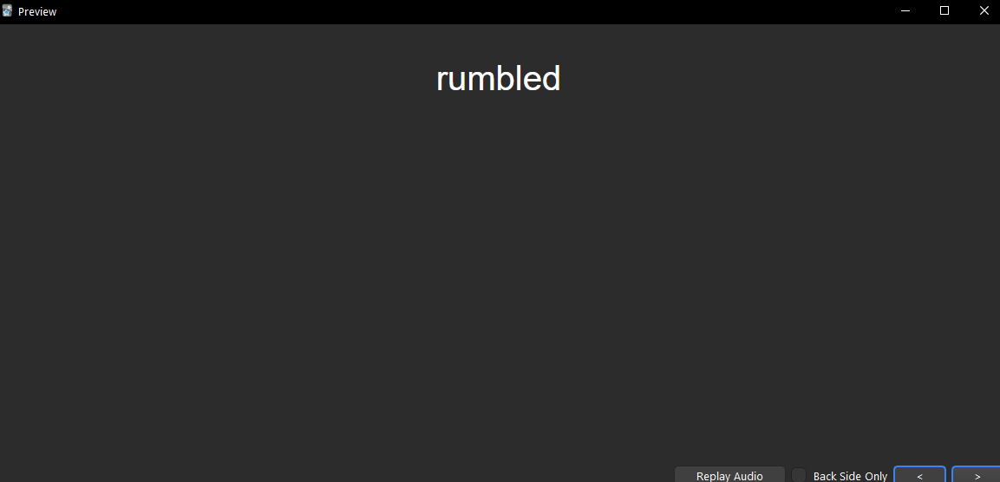
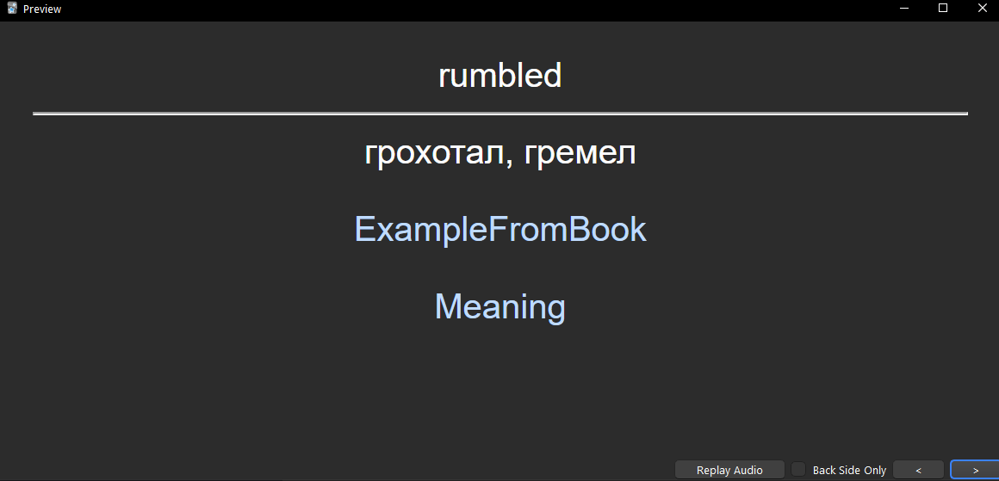
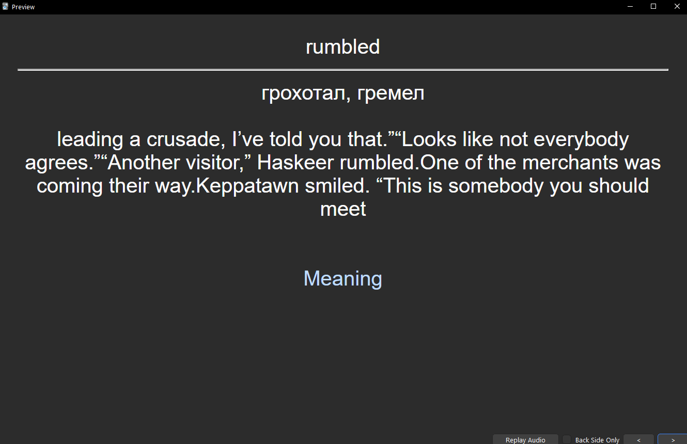
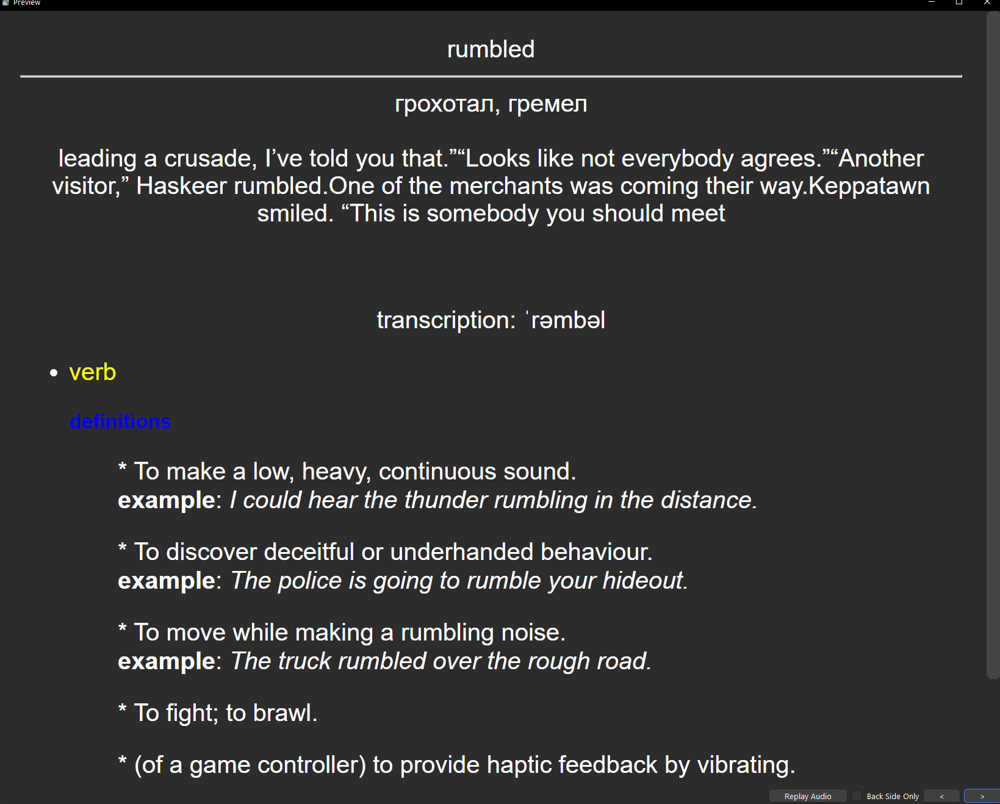

## korvo-to-anki

[](https://github.com/Dankoy/korvo-to-anki/releases/latest)


[](https://github.com/Dankoy/korvo-to-anki/actions/workflows/gradle.yml)


Convert sqlite created
by [vocabulary_builder plugin](https://github.com/koreader/koreader/wiki/Vocabulary-builder)
of [KOReader](https://github.com/koreader/koreader) into text file that can be easily
imported to anki

If you want to lemmatize all your words then check another utility - [korvo-to-anki-lemmatizer](https://github.com/Dankoy/korvo-to-anki-lemmatizer)

> [!NOTE]
> If you have questions about running this utility then feel free to ask it in [github discusstions](https://github.com/Dankoy/korvo-to-anki/discussions) or in [discord server](https://discord.gg/XnMZStkNMC)

### Stack

* Java 21
* Spring boot ~~3.3.2~~ -> 4.0.0
* Spring shell
* Spring boot jdbc
* Caffeine cache
* ~~OkHttp~~
* WebClient (since spring boot 3.4.0)
* Freemarker
* Liquibase 
* Flyway
* Gradle

### Integrations

Added integration with external services for word translation and definition lookup:

1. Google Translate. [See also](https://koreader.rocks/doc/modules/ui.translator.html)
2. [dictionaryapi.dev](https://dictionaryapi.dev/)

### Usage

Download app.jar.zip from [releases](https://github.com/Dankoy/korvo-to-anki/releases), and extract jar somewhere.

Program will look up every word in GT for translation, transcription and definitions (with default
options), and dictionaryapi (if enabled) for definitions, synonyms, antonyms and examples and
transcription. If word in dictionary api is found then only this data is used. If word in dictionary
api is not found, then data from GT is used. If none found, then meanings are empty, because GT at
least has a translation.    
GT can translate from any language to any language, but dictionary api works only with english
source language.

#### Available options of jar startup

```shell
korvo-to-anki.api.dictionaryApiEnabled: true/false - turn on or off dictionaryapi service integration. Default - true
korvo-to-anki.async-type: "vtcf/completable_future" - use virtual threads or completable future as async core. Default vtcf
```

#### On linux

`java -jar -Dspring.datasource.url=jdbc:sqlite:/path/to/vocabulary_builder.sqlite3 korvo-to-anki.jar `

#### On windows

`java "-Dspring.datasource.url=jdbc:sqlite:\path\to\vocabulary_builder.sqlite3" -jar .\korvo-to-anki.jar`

#### Command to export

```text
SYNOPSIS
       anki-exporter --sourceLanguage String --targetLanguage String --options String[]

OPTIONS
       --sourceLanguage String
       source language
       [Optional, default = auto]

       --targetLanguage String
       target language
       [Optional, default = ru]

       --options String[]
       options
       [Optional, default = t,at,md,rm]

       --help or -h
       help for anki-exporter
       [Optional]
```

`ae --sourceLanguage ja --targetLanguage en --options t,at,md,rm`

Options t,at,md,rm are the only options that currently works. These options are google translate
options.

#### Run result

The result of run is going to be stored in the same folder as jar with name -
**korvo-to-anki-TIMESTAMP.txt**. Also creates **korvo-to-anki-state.sqlite3** sqlite db file with
the words of already exported words. On new run will check for state in state database and filter
already exported words from new run.

#### Show definitions in cards

Export is made using html for definitions, synonyms, antonyms, examples if any found in
dictionaryapi. To show them in card one has to change card template.

##### Back template

```text
{{FrontSide}}

<hr id=answer>

{{Back}}

<br><br>
{{hint:ExampleFromBook}}

<br><br>
{{hint:Meaning}}
```

#### Flipped front template

```text
{{Back}}

<br><br>
{{hint:ExampleFromBook}}

<br><br>
{{hint:Meaning}}
```

#### Example result

```text
#separator:pipe
#html:true
#deck column:1
#tags column:6
korvo-to-anki::The Sorrows of Satan (Horror Classic)|trifle|мелочь, пустячок||<p> transcription: /ˈtɹaɪfəl/</p><ul><li><span style="color:yellow">noun</span><dl><dt><h5 style="margin-bottom:0;margin-top:0;color:blue">definitions</h5></dt><dd style="margin-bottom:10px"><p style="margin-bottom: 0px">* An English dessert made from a mixture of thick custard, fruit, sponge cake, jelly and whipped cream.</p></dd><dd style="margin-bottom:10px"><p style="margin-bottom: 0px">* Anything that is of little importance or worth.</p></dd><dd style="margin-bottom:10px"><p style="margin-bottom: 0px">* A very small amount (of something).</p></dd><dd style="margin-bottom:10px"><p style="margin-bottom: 0px">* A particular kind of pewter.</p></dd><dd style="margin-bottom:10px"><p style="margin-bottom: 0px">* Utensils made from this particular kind of pewter.</p></dd><dt><h5 style="margin-bottom:0;margin-top:0;color:green">synonyms</h5></dt><dd>bagatelle</dd><dd>minor detail</dd><dd>whiffle</dd><dd>smidgen</dd></dl></li><li><span style="color:yellow">verb</span><dl><dt><h5 style="margin-bottom:0;margin-top:0;color:blue">definitions</h5></dt><dd style="margin-bottom:10px"><p style="margin-bottom: 0px">* To deal with something as if it were of little importance or worth.</p><p style="margin-top:1px"><b>example</b>: <span><i>You must not trifle with her affections.</i></span></p></dd><dd style="margin-bottom:10px"><p style="margin-bottom: 0px">* To act, speak, or otherwise behave with jest.</p></dd><dd style="margin-bottom:10px"><p style="margin-bottom: 0px">* To inconsequentially toy with something.</p></dd><dd style="margin-bottom:10px"><p style="margin-bottom: 0px">* To squander or waste.</p></dd><dd style="margin-bottom:10px"><p style="margin-bottom: 0px">* To make a trifle of, to make trivial.</p></dd><dt><h5 style="margin-bottom:0;margin-top:0;color:green">synonyms</h5></dt><dd>fritter</dd><dd>wanton</dd><dd>fiddle</dd></dl></li></ul>|korvo-to-anki::noun korvo-to-anki::verb korvo-to-anki::the_sorrows_of_satan_(horror_classic)
korvo-to-anki::The Time Machine|flaxen|льняной, лен|was a dull white, and had strange large greyish-red eyes; also that there was flaxen hair on its head and down its back. But, as I say, it went too fast|<p> transcription: /ˈflæk.sən/</p><ul><li><span style="color:yellow">adjective</span><dl><dt><h5 style="margin-bottom:0;margin-top:0;color:blue">definitions</h5></dt><dd style="margin-bottom:10px"><p style="margin-bottom: 0px">* Made of or resembling flax fibers.</p><p style="margin-top:1px"><b>example</b>: <span><i>The couple and their children have flaxen hair.</i></span></p></dd><dd style="margin-bottom:10px"><p style="margin-bottom: 0px">* A pale yellow brown; the colour of dried flax stalks and of the fiber obtained therefrom.</p></dd></dl></li></ul>|korvo-to-anki::adjective korvo-to-anki::the_time_machine
korvo-to-anki::The Darkness That Comes Before|apprehend|задержать, схватить|beasts?”“Because like beasts, Man stands within the circuit of before and after, and yet he apprehend(apprehends) the Logos. He possesses intellect.”“Indeed. And why, Kellhus, do the Dûnyain breed for intellect? Why|<p> transcription: /æ.pɹiˈhɛnd/</p><ul><li><span style="color:yellow">verb</span><dl><dt><h5 style="margin-bottom:0;margin-top:0;color:blue">definitions</h5></dt><dd style="margin-bottom:10px"><p style="margin-bottom: 0px">* To take or seize; to take hold of.</p></dd><dd style="margin-bottom:10px"><p style="margin-bottom: 0px">* To take hold of with the understanding, that is, to conceive in the mind; to become cognizant of; to understand; to recognize; to consider.</p></dd><dd style="margin-bottom:10px"><p style="margin-bottom: 0px">* To anticipate; especially, to anticipate with anxiety, dread, or fear; to fear.</p></dd><dd style="margin-bottom:10px"><p style="margin-bottom: 0px">* To think, believe, or be of opinion; to understand; to suppose.</p></dd><dd style="margin-bottom:10px"><p style="margin-bottom: 0px">* To be apprehensive; to fear.</p></dd><dt><h5 style="margin-bottom:0;margin-top:0;color:green">synonyms</h5></dt><dd>arrest</dd><dd>believe</dd><dd>capture</dd><dd>catch</dd><dd>conceive</dd><dd>detain</dd><dd>dread</dd><dd>fear</dd><dd>imagine</dd><dd>seize</dd><dd>understand</dd></dl></li></ul>|korvo-to-anki::verb korvo-to-anki::the_darkness_that_comes_before
korvo-to-anki::The Dark Forest|disregard|игнорировать, не обращать внимания|the Milky Way could be thousands of times that. Perhaps nine hundred thousand of them will disregard the marking. Of the remaining one hundred thousand, maybe ninety thousand of them will probe the|<p> transcription: /dɪsɹɪˈɡɑːd/</p><ul><li><span style="color:yellow">noun</span><dl><dt><h5 style="margin-bottom:0;margin-top:0;color:blue">definitions</h5></dt><dd style="margin-bottom:10px"><p style="margin-bottom: 0px">* The act or state of deliberately not paying attention or caring about; misregard.</p><p style="margin-top:1px"><b>example</b>: <span><i>The government's disregard for the needs of disabled people is outrageous.</i></span></p></dd></dl></li><li><span style="color:yellow">verb</span><dl><dt><h5 style="margin-bottom:0;margin-top:0;color:blue">definitions</h5></dt><dd style="margin-bottom:10px"><p style="margin-bottom: 0px">* To ignore; pay no attention to.</p></dd><dt><h5 style="margin-bottom:0;margin-top:0;color:green">synonyms</h5></dt><dd>misregard</dd><dd>unheed</dd><dd>unmind</dd></dl></li></ul>|korvo-to-anki::noun korvo-to-anki::verb korvo-to-anki::the_dark_forest
korvo-to-anki::Orcs|indignation|негодование, возмущение|the burning of certain herbs so that he may inhale their goodness,” he replied with slight indignation. “And entreaties to the gods, naturally.”“Herbs and prayers? That’s all right as far as|<p> transcription: /ˌɪn.dɪɡ.ˈneɪ.ʃən/</p><ul><li><span style="color:yellow">noun</span><dl><dt><h5 style="margin-bottom:0;margin-top:0;color:blue">definitions</h5></dt><dd style="margin-bottom:10px"><p style="margin-bottom: 0px">* An anger aroused by something perceived as an indignity, notably an offense or injustice.</p></dd><dd style="margin-bottom:10px"><p style="margin-bottom: 0px">* A self-righteous anger or disgust.</p></dd></dl></li></ul>|korvo-to-anki::noun korvo-to-anki::orcs

```

When imported to anki new deck will be created with name korvo-to-anki. Inside this deck will be
created subdecks with book title.

Also to each card tags are added to categorize word type (noun, verb, pronoun, adjective, etc) and book title. One card could have multiple types in tags.

Duplicates are checked by anki when imported.

### Limits

If you have too many words (450 and more) then app will hit the rate limiter of external
service [dictionaryapi.dev](https://dictionaryapi.dev/). The current limit is 450 requests in 5
minutes. ~~When reached, app fall asleep for 5 minutes and then retry to get word definition of last
word and run further as normal until requests limit is reached again~~. App should never hit rate limit, because of implementation of local rate limiter which does 15 requests in 10 seconds or 90 requests in one minute or 450 requests in 5 minutes.


With all limitations export of 3080 words with sleep timeout was done in about _**30 minutes**_

Dictionary api works only with english source language. Any other languages won't work same as auto.

### Example

    
   
    

